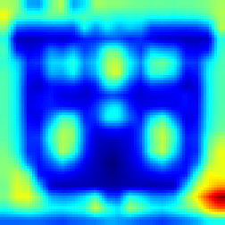

# Explaining RL Agents in Atari Games
Authors: Amir Bikineyev, Dzhavid Sadreddinov

Link to the source: [github](https://github.com/sadjava/fullgradpp_xai)
## Installation 
The process of inference and installation are same as [here](https://github.com/floringogianu/atari-agents/tree/main)


## Introduction

By now, many people have at least heard of Atari games — and some have even played them. Classics like our beloved Pong, Breakout, Space Invaders, and others come to mind (see images below). While these games were originally popular in the late 20th century purely for entertainment, today they serve a different purpose for many: their simplicity makes them ideal environments for experimenting with reinforcement learning (RL) agents.

Today, we’ll join that group — but with a slightly different goal. Our task is to explore how a neural network "thinks" and what it pays attention to. To do this, we’ll implement the Grad-CAM method on a convolutional neural network.


## Agent Overview
### The Q-value estimator

For our agent model, we used the Deep Q-Network (DQN) architecture. The model consists of two main components: a feature extractor and a Q-value head.

The feature extractor is a convolutional neural network (CNN) that takes as input a stack of 4 consecutive frames from the game environment. It looks like:

```python
self.__features = nn.Sequential(
    nn.Conv2d(4, 32, kernel_size=8, stride=4),
    nn.ReLU(),
    nn.Conv2d(32, 64, kernel_size=4, stride=2),
    nn.ReLU(),
    nn.Conv2d(64, 64, kernel_size=3, stride=1),
    nn.ReLU()
)
```
The Q-value head can take one of two forms:

* In the standard DQN setup, it's a simple linear network that outputs a single Q-value for each possible action.

* In the distributional DQN version, instead of outputting a single Q-value, it predicts a probability distribution over a set of fixed values (called "atoms") — for example, 51 evenly spaced points between –10 and 10. These outputs (logits) are passed through a softmax to produce a probability distribution, and the final expected Q-value is computed as a weighted average using the formula ⟨probabilities, support⟩.

The Q-value head:


```python
self.__head = nn.Sequential(
    nn.Linear(64*7*7, 512), 
    nn.ReLU(),
    nn.Linear(512, out_size)  
)
```

### Game process
For each atari game we have taken trained model and environment in the Arcade Learning Environment (ALE). Before make decision we give to the model previous 4 frames and each chosen action of the model will be held in future 4 frames. The model take each action via ε-greedy policy.

Below you can see the examples of playing:


## CAM methods

### What is Grad-CAM?

Gradient-weighted Class Activation Map (Grad-CAM) used to generate heatmaps that highlight the important regions of an image contributing to the model's performance.

### How it Works

In general the Grad-CAM algorithm working as follows:
* Picking a layer which will be used for explanation. Usually the last layers are used because they're process the high level features that will be understandable by humans
* Then we passing the input that we want to explain through our model and particularly through our picked layer to obtain feature-map
* Then we need to calculate the gradients of the predicted class/decision via backward pass with respect to feature maps in the chosen layer. Mathematically speaking:

  ```math
  \alpha_k^c = \frac{1}{Z} \sum_{i,j} \frac{\partial y^c}{\partial A_{i,j}^k}
  ```

  where $Z$ is the size of the feature map (width × height), $y^c$ is the score for class $c$, and $A_{i,j}^k$ represents the activations of the $k^{\text{th}}$ feature map at spatial location $(i, j)$.
* After all we need to obtain importance map by multiplying each feature map $A_{}^k$ by the $\alpha_k^c$ and summarize to obtain heatmap
  ```math
  L_{\text{Grad-CAM}}^c = \text{ReLU} \left( \sum_k \alpha_k^c A^k \right)
  ```
* Then the resulting image we upsampling and overlaying on top of the input image to vizualize the regions that contribute most to the model's decisions.
### What is Grad-CAM++?

Grad-CAM++ is an enhanced version of Grad-CAM that produces more precise and localized heatmaps.
### Differences from Grad-CAM
* Grad-CAM++ replaces this uniform averaging with a pixel-wise weighted sum that uses both second- and third-order gradients, emphasizing locations where small activation changes greatly affect the class score:
  ```math
  \alpha_k^c = \sum_{i,j} \left[
  \frac{
  \frac{\partial^2 y^c}{(\partial A_{i,j}^k)^2}
  }{
  2\frac{\partial^2 y^c}{(\partial A_{i,j}^k)^2} + \sum_{i,j} A_{i,j}^k \frac{\partial^3 y^c}{(\partial A_{i,j}^k)^3}
  }
  \right]
  ```
### What is FullGrad?
FullGrad is a complete gradient-based explanation method that aggregates gradient information from all layers of a neural network (not just one convolutional layer) to explain model decisions. Unlike Grad-CAM, which focuses on a single layer, FullGrad accounts for biases and activations across the entire network, providing more holistic explanations.
### How it works?
* Firstly we need to compute calculate gradients for every layer of the target class/decision of the model with respect to both activations and biases $\nabla_{A^l} y^c $ (activation gradients) $\nabla_{b^l} y^c $ (bias gradients)
* Then we need to combine gradients and biases across all layers into a single saliency map:
  ```math
  L_{\text{FullGrad}}^c = \sum_l \left( A^l \odot \nabla_{A^l} y^c + b^l \odot \nabla_{b^l} y^c \right)
  ```
  ⊙ - element-wise multiplication
* After all the final map is upsampled and overlaid on the input image, similar to Grad-CAM.
### CAM methods example
Below you can see how heatmaps for each CAM method is works

### Techcnique that we used
We used 2 tecnhiques to explain the decision of the agent:

* Fullgrad approach: We build classic fullgrad algorithm to hook the features part of AtariNet.
* Experimental approach. This method merges the strengths of **FullGrad** and **Grad-CAM++** into a unified framework. It is designed to provide highly detailed, high-fidelity saliency maps by:

  - Aggregating **gradient information across all layers** like FullGrad
  - Incorporating **second-order gradient weighting** from Grad-CAM++ for better localization
  
  This method captures both deep model internals (via bias gradients) and fine-grained sensitivity (via higher-order gradient contributions), producing comprehensive and sharper visual explanations.


### How experimental approach works

This method consists of the following steps:

1. **Forward Pass and Hooking**:
   - Register hooks on all layers that contain learnable bias parameters (e.g., `Conv2d`, `BatchNorm2d`) to record:
     - Their output activations $A^l$
     - Their backpropagated gradients $\nabla_{A^l} y^c$
   - Store bias tensors  $b^l$ as well for use in explanation

2. **Backward Pass with Higher-Order Gradients**:
   - Perform a backward pass from the model’s output  $y^c$ for a target class $c$
   - Instead of just using first-order gradients, FullGrad++ optionally computes **second-order gradients**:
     ```math
     \text{Grad}_{A^l} = \left( \frac{\partial y^c}{\partial A^l} \right)^2
     ```
   - This increases the saliency of regions where small changes in activation highly influence the prediction, similar to Grad-CAM++

3. **Bias Gradient Aggregation**:
   - For each bias layer, compute the saliency as the element-wise product:
    ```math
     \text{BiasGrad}_{l} = \left| b^l \cdot \left( \frac{\partial y^c}{\partial b^l} \right)^2 \right|
    ```
   - These maps are interpolated to match the input size

4. **Input Gradient Contribution**:
   - Compute the gradient of the class score with respect to the input image \( x \):
     ```math
     \text{InputGrad} = x \cdot \left| \frac{\partial y^c}{\partial x} \right|
     ```
   - This highlights sensitive areas in the raw input

5. **Combining and Normalizing**:
   - Combine all saliency contributions:
     ```math
     L_{\text{FullGrad++}}^c = \text{InputGrad} + \sum_l \text{BiasGrad}_{l}
     ```
   - Smooth the result with a Gaussian filter to reduce noise
   - Normalize the map to [0, 1] and overlay it on the original input image

---

### Implementation Highlights

The method was implemented from scratch in PyTorch without relying on external libraries like `pytorch-grad-cam`. Key implementation details include:

- **Hook Registration**:
  Forward and backward hooks are attached dynamically to all bias layers.
  ```python
      def _register_hooks(self):
        def has_bias(layer):
            return isinstance(layer, (nn.Conv2d, nn.BatchNorm2d)) and layer.bias is not None

        for layer in self.model.modules():
            if has_bias(layer):
                layer_id = id(layer)
                self.biases.append((layer_id, self._extract_bias(layer).to(self.device)))

                def fwd_hook(module, inp, outp):
                    self.activations.append((id(module), outp))

                def bwd_hook(module, grad_in, grad_out):
                    self.gradients.append((id(module), grad_out[0]))


                layer.register_forward_hook(fwd_hook)
                layer.register_backward_hook(bwd_hook)
  ```
  
- **Bias Extraction**:
  BatchNorm2d biases are computed as:
  ```math
  b^l = -\frac{\mu \cdot \gamma}{\sqrt{\sigma^2 + \epsilon}} + \beta
  ```
  where $\mu$, $\sigma^2$, $\gamma$, $\beta$ are the batch norm parameters.

  ```python
      def _extract_bias(self, layer):
        if isinstance(layer, nn.BatchNorm2d):
            return - (layer.running_mean * layer.weight / torch.sqrt(layer.running_var + layer.eps)) + layer.bias
        return layer.bias
  ```

- **Second-Order Derivatives**:
  Used `torch.autograd.grad(..., create_graph=True)` to compute higher-order terms required for Grad-CAM++ logic.
  ```python
          if self.use_second_order:
            # FullGrad and GradCAM++ — use second-order gradients
            grad = torch.autograd.grad(score, input_tensor, create_graph=True)[0]
        else:
            score.backward(retain_graph=True)
            grad = input_tensor.grad

        cam = torch.abs(grad * input_tensor).sum(dim=1, keepdim=True)
  ```
- **Smoothing**:
  Applied a 2D Gaussian blur kernel to the final heatmap for improved clarity.
  ```python
      def _apply_smoothing(self, saliency, kernel_size=3, sigma=2):
        """Apply 2D Gaussian smoothing per image"""
        if kernel_size % 2 == 0:
            kernel_size += 1
        channels = saliency.shape[1]
        coords = torch.arange(kernel_size, dtype=torch.float32) - kernel_size // 2
        grid = coords.repeat(kernel_size).view(kernel_size, kernel_size)
        gauss = torch.exp(-(grid**2 + grid.T**2) / (2 * sigma**2))
        gauss /= gauss.sum()

        kernel = gauss.view(1, 1, kernel_size, kernel_size).repeat(channels, 1, 1, 1)
        kernel = kernel.to(saliency.device)

        return F.conv2d(saliency, kernel, padding=kernel_size // 2, groups=channels)
  ```
---

### Results
Here we can see the results of explanation for the decisions of AtariNet for different games:

####  Breakout:


At the top we see 2 gifs. The left one is actual game where agent is playinig and on the right side we can see the explanation produced by the FullGrad++ method for the actions taken by the agent. As we can see the agent is paying attention on the player itself, the ball and on the nearest blocks which it can break.
#### Pong:


Here we can see that attention mainly focused on the region where the ball is located which is similar to the way how humans play

#### Enduro


In enduro we can see that agent paying attention on player itself and on the new cars that appeared. In the moment when the agent is made the action the agent stops paying on the cars attention

#### VideoPinball




In video pinball we see that attention is concentrated in score and on the ball.

### Conclusion
Our experiments across multiple Atari games (Breakout, Pong, Enduro, and Video Pinball) demonstrated that the agent's attention aligns with intuitive gameplay strategies—focusing on the ball, player-controlled elements, and key environmental objects.

### References
[Atari RL agent](https://github.com/floringogianu/atari-agents/tree/main)

[Pytorch Grad-CAM](https://github.com/jacobgil/pytorch-grad-cam/tree/master)

[Grad-CAM++](https://arxiv.org/abs/1710.11063)

[FullGrad](https://arxiv.org/abs/1905.00780)